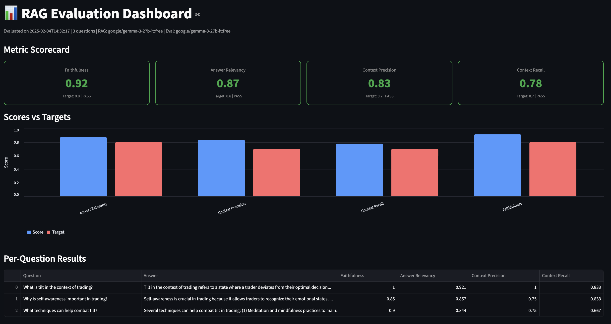
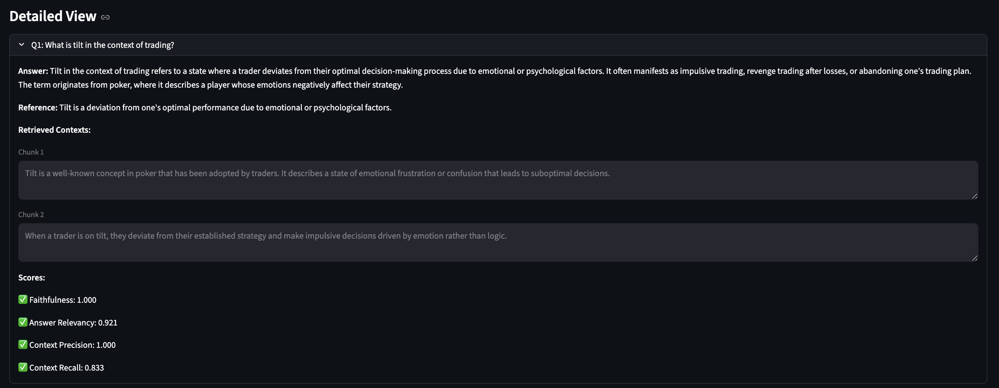

# PDF Chat — RAG Q&A Chatbot

A document Q&A chatbot built with LangChain, OpenRouter, and ChromaDB. Upload a PDF and ask questions — answers are grounded in your document using Retrieval Augmented Generation (RAG). Includes a full RAGAS evaluation pipeline to measure retrieval and generation quality.

## Demo


Upload any PDF — research papers, contracts, reports, manuals — and ask questions in natural language. Answers are generated **only** from your document content, reducing hallucination.

## RAGAS Evaluation Dashboard



The built-in evaluation dashboard shows how well the RAG pipeline performs across 4 key metrics — faithfulness, answer relevancy, context precision, and context recall. Each metric is scored against a target threshold with pass/fail indicators. The grouped bar chart makes it easy to compare actual scores vs targets at a glance.



Drill into per-question results to debug weak spots — see the exact answer generated, the ground truth reference, the retrieved chunks that were used, and individual metric scores for each question.

## System Architecture

```
┌──────────────────────────────────────────────────────────────────────────┐
│                        STREAMLIT APP (multipage)                         │
│                                                                          │
│  ┌─────────────────────────────┐    ┌─────────────────────────────────┐  │
│  │  Page 1: PDF Chat (app.py)  │    │  Page 2: Eval Dashboard         │  │
│  │  ┌───────────┐ ┌──────────┐ │    │  (pages/eval_dashboard.py)      │  │
│  │  │ PDF Upload│ │Chat UI   │ │    │  ┌───────────┐ ┌────────────┐  │  │
│  │  │ (sidebar) │ │(Q&A)     │ │    │  │ Scorecard │ │ Bar Chart  │  │  │
│  │  └─────┬─────┘ └────┬─────┘ │    │  └───────────┘ └────────────┘  │  │
│  │        │             │       │    │  ┌──────────────────────────┐  │  │
│  │        ▼             ▼       │    │  │ Per-Question Detail Table│  │  │
│  │   ingest.py     chain.py     │    │  └──────────────────────────┘  │  │
│  └─────────────────────────────┘    └─────────────────────────────────┘  │
└──────────────────────────────────────────────────────────────────────────┘
         │                │                          │
         ▼                ▼                          ▼
  ┌────────────┐   ┌────────────┐           ┌──────────────┐
  │ HuggingFace│   │ OpenRouter │           │eval_results  │
  │ Embeddings │   │ LLM (free) │           │   .json      │
  │  (local)   │   │            │           │              │
  └────────────┘   └────────────┘           └──────────────┘
```

## Data Ingestion Pipeline

Shows how a PDF is processed from raw file to searchable vectors.

```
                         INGESTION FLOW (ingest.py)

  ┌──────────┐
  │  PDF     │
  │  File    │
  └────┬─────┘
       │
       ▼
  ┌──────────────────────────────────────────────────────┐
  │  1. LOAD — PyPDFLoader                               │
  │                                                      │
  │  Extracts text from each page into Document objects  │
  │  Each Document = { page_content, metadata: {page} }  │
  │                                                      │
  │  Input:  report.pdf (12 pages)                       │
  │  Output: [Doc(page=0), Doc(page=1), ..., Doc(page=11)]│
  └────────────────────────┬─────────────────────────────┘
                           │
                           ▼
  ┌──────────────────────────────────────────────────────┐
  │  2. CHUNK — RecursiveCharacterTextSplitter           │
  │                                                      │
  │  Splits text into overlapping pieces for retrieval.  │
  │  Tries separators in order: "\n\n" → "\n" → " " → ""│
  │  to preserve paragraph/sentence boundaries.          │
  │                                                      │
  │  Config: chunk_size=1000, chunk_overlap=200          │
  │                                                      │
  │  Example of overlap:                                 │
  │  ┌──────────────────────────┐                        │
  │  │       Chunk 1            │                        │
  │  │  "The quarterly report   │                        │
  │  │   shows revenue growth   │                        │
  │  │   of 15% driven by..."  ─┼──┐  ← overlap zone    │
  │  └──────────────────────────┘  │    (200 chars)      │
  │       ┌────────────────────────┼──────────┐          │
  │       │  "...of 15% driven by  │          │          │
  │       │   new product launches │ Chunk 2  │          │
  │       │   in Q3 which..."     │          │          │
  │       └───────────────────────────────────┘          │
  │                                                      │
  │  Input:  12 page Documents                           │
  │  Output: ~50-80 chunks (depends on PDF length)       │
  └────────────────────────┬─────────────────────────────┘
                           │
                           ▼
  ┌──────────────────────────────────────────────────────┐
  │  3. EMBED — HuggingFace all-MiniLM-L6-v2 (local)    │
  │                                                      │
  │  Converts each chunk into a 384-dim float vector.    │
  │  Runs locally — no API calls, completely free.       │
  │  Semantically similar text → vectors close together. │
  │                                                      │
  │  "revenue growth of 15%"  → [0.023, -0.041, ...]    │
  │  "profits increased 15%"  → [0.025, -0.039, ...]  ← similar!
  │  "the weather was sunny"  → [0.512,  0.203, ...]  ← different
  │                                                      │
  └────────────────────────┬─────────────────────────────┘
                           │
                           ▼
  ┌──────────────────────────────────────────────────────┐
  │  4. STORE — ChromaDB (local, persisted to disk)      │
  │                                                      │
  │  Stores each chunk with its vector + metadata.       │
  │  Persisted to ./chroma_db/ so it survives restarts.  │
  │                                                      │
  │  ┌────────────────────────────────────────────────┐  │
  │  │  id   │ vector          │ text        │ page   │  │
  │  │───────│─────────────────│─────────────│────────│  │
  │  │  c_0  │ [0.02, -0.04]  │ "The quart" │  0     │  │
  │  │  c_1  │ [0.03, -0.03]  │ "of 15% dr" │  0     │  │
  │  │  ...  │ ...             │ ...         │  ...   │  │
  │  └────────────────────────────────────────────────┘  │
  └──────────────────────────────────────────────────────┘
```

## Query & Retrieval Flow

Shows what happens when a user asks a question.

```
                    QUERY FLOW (chain.py + retriever.py)

  ┌─────────────────┐
  │  User Question   │
  │  "What was Q3    │
  │   revenue?"      │
  └───────┬─────────┘
          │
          ▼
  ┌──────────────────────────────────────────────────────┐
  │  1. EMBED QUERY — Same embedding model as ingestion  │
  │                                                      │
  │  "What was Q3 revenue?" → [0.019, -0.038, ...]      │
  └────────────────────────┬─────────────────────────────┘
                           │
                           ▼
  ┌──────────────────────────────────────────────────────┐
  │  2. SIMILARITY SEARCH — ChromaDB (retriever.py)      │
  │                                                      │
  │  Compare query vector against all stored vectors     │
  │  using cosine similarity. Return top-k=4 matches.   │
  │                                                      │
  │  ┌────────────────────────────────────────────────┐  │
  │  │  Query: [0.019, -0.038, ...]                   │  │
  │  │                                                │  │
  │  │  Chunk c_12: similarity = 0.94  ← MATCH       │  │
  │  │  Chunk c_7:  similarity = 0.91  ← MATCH       │  │
  │  │  Chunk c_33: similarity = 0.87  ← MATCH       │  │
  │  │  Chunk c_1:  similarity = 0.85  ← MATCH       │  │
  │  │  Chunk c_45: similarity = 0.41  ← too low     │  │
  │  └────────────────────────────────────────────────┘  │
  │                                                      │
  │  Returns: top 4 Document objects with page_content   │
  └────────────────────────┬─────────────────────────────┘
                           │
                           ▼
  ┌──────────────────────────────────────────────────────┐
  │  3. PROMPT CONSTRUCTION — Stuff documents into prompt │
  │                                                      │
  │  ┌────────────────────────────────────────────────┐  │
  │  │  SYSTEM: You are a helpful assistant that      │  │
  │  │  answers based on the provided context. Use    │  │
  │  │  ONLY the following context. If insufficient,  │  │
  │  │  say "I don't have enough information."        │  │
  │  │                                                │  │
  │  │  Context:                                      │  │
  │  │  [chunk c_12 text]                             │  │
  │  │  [chunk c_7 text]                              │  │
  │  │  [chunk c_33 text]                             │  │
  │  │  [chunk c_1 text]                              │  │
  │  │                                                │  │
  │  │  HUMAN: What was Q3 revenue?                   │  │
  │  └────────────────────────────────────────────────┘  │
  └────────────────────────┬─────────────────────────────┘
                           │
                           ▼
  ┌──────────────────────────────────────────────────────┐
  │  4. LLM GENERATION — Gemma 3 27B via OpenRouter      │
  │                                                      │
  │  The model reads ONLY the provided chunks and        │
  │  generates a grounded answer. Temperature=0 makes    │
  │  output deterministic (same input → same output).    │
  │                                                      │
  │  Output: "Q3 revenue was $4.2M, a 15% increase..."  │
  └──────────────────────────────────────────────────────┘
```

## RAGAS Evaluation Pipeline

The evaluation module measures how well the RAG system performs across 4 dimensions using the [RAGAS](https://docs.ragas.io/) framework. RAGAS uses an **LLM-as-Judge** pattern — a separate LLM call scores each metric by analyzing the question, answer, retrieved contexts, and ground truth.

### Why Evaluate?

RAG systems can fail silently — the app looks like it's working, but answers might be hallucinated, irrelevant, or missing key information. RAGAS catches these issues quantitatively:

```
  ┌─────────────────────────────────────────────────────────────────┐
  │                     WHY RAGAS EVALUATION?                       │
  │                                                                 │
  │  Without evaluation:                                            │
  │  ┌───────────────────────────────────────────────────────────┐  │
  │  │  Q: "What are the side effects?"                         │  │
  │  │  A: "The main side effects include headaches and nausea" │  │
  │  │                                                          │  │
  │  │  Looks correct! But...                                   │  │
  │  │  ❌ Answer includes "nausea" — NOT in retrieved context  │  │
  │  │  ❌ Retrieved chunks were about dosage, not side effects │  │
  │  │  ❌ Ground truth mentions 5 side effects, answer has 2   │  │
  │  └───────────────────────────────────────────────────────────┘  │
  │                                                                 │
  │  With RAGAS:                                                    │
  │  ┌───────────────────────────────────────────────────────────┐  │
  │  │  Faithfulness:       0.50 ❌ (hallucinated "nausea")     │  │
  │  │  Answer Relevancy:   0.85 ✅                              │  │
  │  │  Context Precision:  0.25 ❌ (retrieved wrong chunks)    │  │
  │  │  Context Recall:     0.40 ❌ (missed 3 of 5 facts)      │  │
  │  └───────────────────────────────────────────────────────────┘  │
  │                                                                 │
  │  Now you know EXACTLY what to fix:                              │
  │  → Improve retrieval (chunk size? embeddings? top-k?)           │
  │  → Tighten the prompt to reduce hallucination                   │
  └─────────────────────────────────────────────────────────────────┘
```

### Evaluation Flow

```
                    EVALUATION FLOW (eval.py)

  ┌──────────────────────────────────────────────────────┐
  │  eval_dataset.json                                   │
  │                                                      │
  │  [                                                   │
  │    { "question": "...", "ground_truth": "..." },     │
  │    { "question": "...", "ground_truth": "..." },     │
  │    ...                                               │
  │  ]                                                   │
  └────────────────────────┬─────────────────────────────┘
                           │
                           ▼
  ┌──────────────────────────────────────────────────────┐
  │  1. COLLECT RAG RESPONSES                            │
  │                                                      │
  │  For each question, run the full RAG chain and       │
  │  capture BOTH the answer AND the retrieved contexts  │
  │  in a single pass (via build_rag_chain_with_context) │
  │                                                      │
  │  Why single pass?                                    │
  │  If we called retrieval and generation separately,   │
  │  we might get different chunks — making evaluation   │
  │  inaccurate. Single pass guarantees the contexts     │
  │  scored are the EXACT ones used to generate.         │
  │                                                      │
  │  Output per question:                                │
  │  {                                                   │
  │    user_input: "What is the main topic?",            │
  │    response: "The main topic is...",                 │
  │    retrieved_contexts: ["chunk1", "chunk2", ...],    │
  │    reference: "The document discusses..."            │
  │  }                                                   │
  └────────────────────────┬─────────────────────────────┘
                           │
                           ▼
  ┌──────────────────────────────────────────────────────┐
  │  2. BUILD RAGAS EVALUATION DATASET                   │
  │                                                      │
  │  Convert collected responses into RAGAS v0.4 format: │
  │  EvaluationDataset of SingleTurnSample objects       │
  │                                                      │
  │  Each sample contains:                               │
  │  - user_input       (the question)                   │
  │  - response         (LLM's answer)                   │
  │  - retrieved_contexts (chunks used)                  │
  │  - reference        (ground truth)                   │
  └────────────────────────┬─────────────────────────────┘
                           │
                           ▼
  ┌──────────────────────────────────────────────────────┐
  │  3. RAGAS EVALUATE — LLM-as-Judge                    │
  │                                                      │
  │  RAGAS uses a separate LLM call to score each metric │
  │  The evaluator LLM reads the question, answer, and   │
  │  contexts, then judges quality on each dimension.    │
  │                                                      │
  │  Evaluator: Gemma 3 27B (free, via OpenRouter)       │
  │  Embeddings: all-MiniLM-L6-v2 (local, for relevancy)│
  │                                                      │
  │  ┌────────────────────────────────────────────────┐  │
  │  │  For each (question, answer, contexts):        │  │
  │  │                                                │  │
  │  │  Faithfulness:       LLM checks each claim     │  │
  │  │  Answer Relevancy:   LLM + embeddings compare  │  │
  │  │  Context Precision:  LLM judges chunk relevance│  │
  │  │  Context Recall:     LLM checks fact coverage  │  │
  │  └────────────────────────────────────────────────┘  │
  │                                                      │
  │  Rate limit handling:                                │
  │  Free tier = 20 req/min, 50 req/day                 │
  │  Built-in exponential backoff retries automatically  │
  └────────────────────────┬─────────────────────────────┘
                           │
                           ▼
  ┌──────────────────────────────────────────────────────┐
  │  4. OUTPUT — eval_results.json                       │
  │                                                      │
  │  {                                                   │
  │    "metadata": { timestamp, models, num_questions }, │
  │    "targets": { faithfulness: 0.8, ... },            │
  │    "aggregate_scores": { faithfulness: 0.92, ... },  │
  │    "per_question": [                                 │
  │      { question, answer, contexts, scores: {...} }   │
  │    ]                                                 │
  │  }                                                   │
  └────────────────────────┬─────────────────────────────┘
                           │
                           ▼
  ┌──────────────────────────────────────────────────────┐
  │  5. DASHBOARD — pages/eval_dashboard.py              │
  │                                                      │
  │  ┌──────────┐ ┌──────────┐ ┌──────────┐ ┌────────┐  │
  │  │Faith: 0.9│ │Relev: 0.8│ │Prec: 0.8 │ │Rec: 0.7│  │
  │  │  PASS ✓  │ │  PASS ✓  │ │  PASS ✓  │ │ PASS ✓ │  │
  │  └──────────┘ └──────────┘ └──────────┘ └────────┘  │
  │                                                      │
  │  ┌────────────────────────────────────────────────┐  │
  │  │  Grouped Bar Chart: Score vs Target (Altair)  │  │
  │  │  Blue = actual score, Red = target threshold   │  │
  │  └────────────────────────────────────────────────┘  │
  │                                                      │
  │  ┌────────────────────────────────────────────────┐  │
  │  │  Per-Question Table + Expandable Detail View   │  │
  │  │  (see exact chunks, reference, scores per Q)   │  │
  │  └────────────────────────────────────────────────┘  │
  └──────────────────────────────────────────────────────┘
```

### What Each Metric Measures

```
  ┌────────────────────────────────────────────────────────────────────┐
  │                         RAGAS METRICS                              │
  │                                                                    │
  │  ┌──────────────────────────────────────────────────────────────┐  │
  │  │  FAITHFULNESS (target > 0.8)                                 │  │
  │  │  "Is the answer grounded in the retrieved context?"          │  │
  │  │                                                              │  │
  │  │  How it works:                                               │  │
  │  │  1. LLM extracts individual claims from the answer          │  │
  │  │  2. For each claim, LLM checks: "Is this in the context?"  │  │
  │  │  3. Score = supported claims / total claims                 │  │
  │  │                                                              │  │
  │  │  Score 1.0 → every claim is backed by context (no halluc.) │  │
  │  │  Score 0.5 → half the claims are made up                   │  │
  │  └──────────────────────────────────────────────────────────────┘  │
  │                                                                    │
  │  ┌──────────────────────────────────────────────────────────────┐  │
  │  │  ANSWER RELEVANCY (target > 0.8)                             │  │
  │  │  "Does the answer actually address the question?"            │  │
  │  │                                                              │  │
  │  │  How it works:                                               │  │
  │  │  1. LLM generates N questions from the answer               │  │
  │  │  2. Embedding model computes similarity to original Q       │  │
  │  │  3. Score = average cosine similarity                       │  │
  │  │                                                              │  │
  │  │  Score 1.0 → answer perfectly addresses the question        │  │
  │  │  Score 0.2 → answer is off-topic                            │  │
  │  └──────────────────────────────────────────────────────────────┘  │
  │                                                                    │
  │  ┌──────────────────────────────────────────────────────────────┐  │
  │  │  CONTEXT PRECISION (target > 0.7)                            │  │
  │  │  "Are the retrieved chunks actually relevant? (signal:noise)"│  │
  │  │                                                              │  │
  │  │  How it works:                                               │  │
  │  │  1. LLM checks each retrieved chunk against the question    │  │
  │  │  2. Relevant chunks ranked higher = better precision        │  │
  │  │  3. Score = weighted relevance (top-ranked chunks matter)   │  │
  │  │                                                              │  │
  │  │  Score 1.0 → all retrieved chunks are relevant              │  │
  │  │  Score 0.25 → only 1 of 4 chunks was useful                │  │
  │  └──────────────────────────────────────────────────────────────┘  │
  │                                                                    │
  │  ┌──────────────────────────────────────────────────────────────┐  │
  │  │  CONTEXT RECALL (target > 0.7)                               │  │
  │  │  "Did retrieval find ALL the info needed to answer?"         │  │
  │  │                                                              │  │
  │  │  How it works:                                               │  │
  │  │  1. LLM extracts claims from the ground truth               │  │
  │  │  2. For each claim, checks: "Is this in the contexts?"     │  │
  │  │  3. Score = covered claims / total claims                   │  │
  │  │                                                              │  │
  │  │  Score 1.0 → contexts contain everything needed             │  │
  │  │  Score 0.5 → half the key info was not retrieved            │  │
  │  └──────────────────────────────────────────────────────────────┘  │
  └────────────────────────────────────────────────────────────────────┘
```

### How to Run Evaluation

```bash
# 1. Make sure you've already ingested a PDF via the app

# 2. Edit eval_dataset.json with questions specific to your PDF
#    Each entry needs a question and ground_truth answer

# 3. Run the evaluation (takes a few minutes with free tier)
python eval.py

# 4. View results in the dashboard
streamlit run app.py
# Navigate to "📊 RAG Evaluation" in the sidebar
```

## End-to-End Data Flow

Complete picture from PDF upload through evaluation.

```
┌─────────┐  ┌──────────┐  ┌──────────┐  ┌──────────┐  ┌──────────┐
│  USER    │  │ STREAMLIT│  │ INGEST   │  │ CHROMA   │  │OPENROUTER│
│          │  │ (app.py) │  │          │  │ (Vector  │  │ LLM API  │
│          │  │          │  │          │  │  Store)  │  │  (free)  │
└────┬─────┘  └────┬─────┘  └────┬─────┘  └────┬─────┘  └────┬─────┘
     │              │              │              │              │
     │ Upload PDF   │              │              │              │
     │─────────────▶│              │              │              │
     │              │ ingest_pdf() │              │              │
     │              │─────────────▶│              │              │
     │              │              │ embed(local) │              │
     │              │              │─────────────▶│              │
     │              │    done      │              │              │
     │              │◀─────────────│              │              │
     │  "Ready!"    │              │              │              │
     │◀─────────────│              │              │              │
     │              │              │              │              │
     │ Ask question │              │              │              │
     │─────────────▶│              │              │              │
     │              │     similarity search        │              │
     │              │─────────────────────────────▶│              │
     │              │         top-k chunks         │              │
     │              │◀─────────────────────────────│              │
     │              │    LLM generate (chunks + question)        │
     │              │────────────────────────────────────────────▶│
     │              │              │              │     answer    │
     │              │◀────────────────────────────────────────────│
     │   Answer     │              │              │              │
     │◀─────────────│              │              │              │
     │              │              │              │              │

         EVALUATION PHASE (python eval.py)

┌─────────┐  ┌──────────┐  ┌──────────┐  ┌──────────┐  ┌──────────┐
│EVAL DATA│  │ eval.py  │  │ RAG CHAIN│  │  RAGAS   │  │OPENROUTER│
│  .json  │  │          │  │          │  │ EVALUATE │  │(evaluator│
│          │  │          │  │          │  │          │  │  judge)  │
└────┬─────┘  └────┬─────┘  └────┬─────┘  └────┬─────┘  └────┬─────┘
     │              │              │              │              │
     │ load Q&A     │              │              │              │
     │─────────────▶│              │              │              │
     │              │ ask(question)│              │              │
     │              │─────────────▶│              │              │
     │              │  answer +    │              │              │
     │              │  contexts    │              │              │
     │              │◀─────────────│              │              │
     │              │         evaluate(dataset)   │              │
     │              │────────────────────────────▶│              │
     │              │              │              │ judge quality│
     │              │              │              │─────────────▶│
     │              │              │              │   scores     │
     │              │              │              │◀─────────────│
     │              │     scores + per-question   │              │
     │              │◀────────────────────────────│              │
     │              │                             │              │
     │              │──▶ eval_results.json         │              │
     │              │──▶ console summary           │              │
```

## Quick Start

```bash
# Clone and install
git clone https://github.com/edsonleung/rag-chatbot.git
cd rag-chatbot
pip install -r requirements.txt

# Set your OpenRouter API key (free)
cp .env.example .env
# Edit .env with your key from https://openrouter.ai/settings/keys

# Run the app
streamlit run app.py
```

## Project Structure

```
├── app.py                      # Streamlit chat UI (main page)
├── pages/
│   └── eval_dashboard.py       # RAGAS evaluation dashboard (page 2)
├── ingest.py                   # PDF loading, chunking, embedding pipeline
├── retriever.py                # Vector store search interface
├── chain.py                    # LangChain RAG chain (retriever + LLM)
├── eval.py                     # RAGAS evaluation module
├── eval_dataset.json           # Sample evaluation questions
├── requirements.txt
├── .env.example
├── demo.png                    # Chat app screenshot
├── eval_dashboard.png          # Evaluation dashboard screenshot
└── eval_detail.png             # Evaluation detail view screenshot
```

## Tech Stack

- **LangChain** — Orchestration (LCEL chains, prompts, document loaders)
- **OpenRouter** — Free LLM access (Google Gemma 3 27B Instruct)
- **HuggingFace** — Local embeddings (`all-MiniLM-L6-v2`, no API needed)
- **ChromaDB** — Local vector database
- **Streamlit** — Multipage web UI
- **RAGAS** — RAG evaluation framework (v0.4, LLM-as-Judge)
- **Altair** — Data visualization for evaluation charts

## Key Design Decisions

| Decision | Rationale |
|---|---|
| **Chunk size 1000 / overlap 200** | Balances retrieval precision with sufficient context per chunk |
| **RecursiveCharacterTextSplitter** | Preserves paragraph/sentence boundaries vs naive splitting |
| **Temperature 0** | Deterministic outputs for factual Q&A |
| **Top-k=4 retrieval** | Enough context without flooding the prompt |
| **Local embeddings** | Free, fast, no API dependency for embeddings |
| **OpenRouter free tier** | Zero-cost LLM access for both RAG and evaluation |
| **LCEL pipe operator** | Modern LangChain chain composition (`retriever \| prompt \| llm`) |
| **Single-pass eval** | `build_rag_chain_with_context()` captures answer + contexts together |
| **Separate eval model** | Uses a different model for judging to spread rate limits |
| **Exponential backoff** | Handles free-tier rate limits automatically (429 retries) |

## License

MIT
