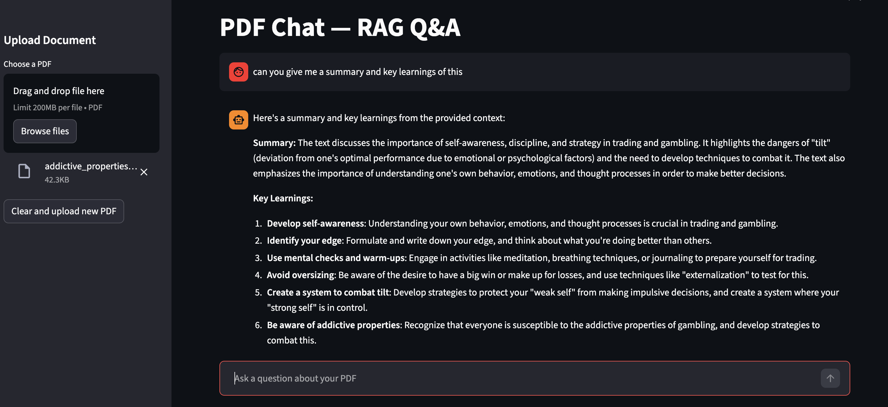

# PDF Chat — RAG Q&A Chatbot

A document Q&A chatbot built with LangChain, OpenRouter, and ChromaDB. Upload a PDF and ask questions — answers are grounded in your document using Retrieval Augmented Generation (RAG).

## Demo



Upload any PDF — research papers, contracts, reports, manuals — and ask questions in natural language. Answers are generated **only** from your document content, reducing hallucination.

## System Architecture

```
┌──────────────────────────────────────────────────────────────────────┐
│                         STREAMLIT UI (app.py)                        │
│  ┌────────────────────────┐    ┌──────────────────────────────────┐  │
│  │     Sidebar            │    │         Chat Interface           │  │
│  │  ┌──────────────────┐  │    │  ┌────────────┐                 │  │
│  │  │  PDF File Upload  │  │    │  │ User Query │                 │  │
│  │  └────────┬─────────┘  │    │  └─────┬──────┘                 │  │
│  │           │             │    │        │                        │  │
│  │  ┌────────▼─────────┐  │    │  ┌─────▼──────────────────────┐ │  │
│  │  │ Ingestion Status │  │    │  │ Chat History + AI Response │ │  │
│  │  └──────────────────┘  │    │  └────────────────────────────┘ │  │
│  └────────────────────────┘    └──────────────────────────────────┘  │
└──────────────────────────────────────────────────────────────────────┘
         │                                    │
         │ PDF bytes                          │ user question
         ▼                                    ▼
┌──────────────────┐                ┌──────────────────┐
│  INGESTION       │                │  RAG CHAIN       │
│  (ingest.py)     │                │  (chain.py)      │
└──────────────────┘                └──────────────────┘
```

## Data Ingestion Pipeline

Shows how a PDF is processed from raw file to searchable vectors.

```
                         INGESTION FLOW (ingest.py)

  ┌──────────┐
  │  PDF     │
  │  File    │
  └────┬─────┘
       │
       ▼
  ┌──────────────────────────────────────────────────────┐
  │  1. LOAD — PyPDFLoader                               │
  │                                                      │
  │  Extracts text from each page into Document objects  │
  │  Each Document = { page_content, metadata: {page} }  │
  │                                                      │
  │  Input:  report.pdf (12 pages)                       │
  │  Output: [Doc(page=0), Doc(page=1), ..., Doc(page=11)] │
  └────────────────────────┬─────────────────────────────┘
                           │
                           ▼
  ┌──────────────────────────────────────────────────────┐
  │  2. CHUNK — RecursiveCharacterTextSplitter           │
  │                                                      │
  │  Splits text into overlapping pieces for retrieval.  │
  │  Tries separators in order: "\n\n" → "\n" → " " → ""│
  │  to preserve paragraph/sentence boundaries.          │
  │                                                      │
  │  ┌────────────────────────────────────────────────┐  │
  │  │  Why chunk?                                    │  │
  │  │  - LLM context windows have token limits       │  │
  │  │  - Smaller chunks = more precise retrieval     │  │
  │  │  - Retrieval returns only relevant passages    │  │
  │  └────────────────────────────────────────────────┘  │
  │                                                      │
  │  Config: chunk_size=1000, chunk_overlap=200          │
  │                                                      │
  │  Example of overlap:                                 │
  │  ┌──────────────────────────┐                        │
  │  │       Chunk 1            │                        │
  │  │  "The quarterly report   │                        │
  │  │   shows revenue growth   │                        │
  │  │   of 15% driven by..."  ─┼──┐  ← overlap zone    │
  │  └──────────────────────────┘  │    (200 chars)      │
  │       ┌────────────────────────┼──────────┐          │
  │       │  "...of 15% driven by  │          │          │
  │       │   new product launches │ Chunk 2  │          │
  │       │   in Q3 which..."     │          │          │
  │       └───────────────────────────────────┘          │
  │                                                      │
  │  Input:  12 page Documents                           │
  │  Output: ~50-80 chunks (depends on PDF length)       │
  └────────────────────────┬─────────────────────────────┘
                           │
                           ▼
  ┌──────────────────────────────────────────────────────┐
  │  3. EMBED — OpenAI text-embedding-3-small            │
  │                                                      │
  │  Converts each chunk into a 1536-dim float vector.   │
  │  Semantically similar text → vectors close together. │
  │                                                      │
  │  "revenue growth of 15%"  → [0.023, -0.041, ...]    │
  │  "profits increased 15%"  → [0.025, -0.039, ...]  ← similar!
  │  "the weather was sunny"  → [0.512,  0.203, ...]  ← different
  │                                                      │
  └────────────────────────┬─────────────────────────────┘
                           │
                           ▼
  ┌──────────────────────────────────────────────────────┐
  │  4. STORE — ChromaDB (local, persisted to disk)      │
  │                                                      │
  │  Stores each chunk with its vector + metadata.       │
  │  Persisted to ./chroma_db/ so it survives restarts.  │
  │                                                      │
  │  ┌────────────────────────────────────────────────┐  │
  │  │  id   │ vector          │ text        │ page   │  │
  │  │───────│─────────────────│─────────────│────────│  │
  │  │  c_0  │ [0.02, -0.04]  │ "The quart" │  0     │  │
  │  │  c_1  │ [0.03, -0.03]  │ "of 15% dr" │  0     │  │
  │  │  ...  │ ...             │ ...         │  ...   │  │
  │  └────────────────────────────────────────────────┘  │
  └──────────────────────────────────────────────────────┘
```

## Query & Retrieval Flow

Shows what happens when a user asks a question.

```
                    QUERY FLOW (chain.py + retriever.py)

  ┌─────────────────┐
  │  User Question   │
  │  "What was Q3    │
  │   revenue?"      │
  └───────┬─────────┘
          │
          ▼
  ┌──────────────────────────────────────────────────────┐
  │  1. EMBED QUERY — Same embedding model as ingestion  │
  │                                                      │
  │  "What was Q3 revenue?" → [0.019, -0.038, ...]      │
  └────────────────────────┬─────────────────────────────┘
                           │
                           ▼
  ┌──────────────────────────────────────────────────────┐
  │  2. SIMILARITY SEARCH — ChromaDB (retriever.py)      │
  │                                                      │
  │  Compare query vector against all stored vectors     │
  │  using cosine similarity. Return top-k=4 matches.   │
  │                                                      │
  │  ┌────────────────────────────────────────────────┐  │
  │  │  Query: [0.019, -0.038, ...]                   │  │
  │  │                                                │  │
  │  │  Chunk c_12: similarity = 0.94  ← MATCH       │  │
  │  │  Chunk c_7:  similarity = 0.91  ← MATCH       │  │
  │  │  Chunk c_33: similarity = 0.87  ← MATCH       │  │
  │  │  Chunk c_1:  similarity = 0.85  ← MATCH       │  │
  │  │  Chunk c_45: similarity = 0.41  ← too low     │  │
  │  │  ...                                           │  │
  │  └────────────────────────────────────────────────┘  │
  │                                                      │
  │  Returns: top 4 Document objects with page_content   │
  └────────────────────────┬─────────────────────────────┘
                           │
                           ▼
  ┌──────────────────────────────────────────────────────┐
  │  3. PROMPT CONSTRUCTION — Stuff documents into prompt │
  │                                                      │
  │  ┌────────────────────────────────────────────────┐  │
  │  │  SYSTEM: You are a helpful assistant that      │  │
  │  │  answers based on the provided context. Use    │  │
  │  │  ONLY the following context. If insufficient,  │  │
  │  │  say "I don't have enough information."        │  │
  │  │                                                │  │
  │  │  Context:                                      │  │
  │  │  [chunk c_12 text]                             │  │
  │  │  [chunk c_7 text]                              │  │
  │  │  [chunk c_33 text]                             │  │
  │  │  [chunk c_1 text]                              │  │
  │  │                                                │  │
  │  │  HUMAN: What was Q3 revenue?                   │  │
  │  └────────────────────────────────────────────────┘  │
  └────────────────────────┬─────────────────────────────┘
                           │
                           ▼
  ┌──────────────────────────────────────────────────────┐
  │  4. LLM GENERATION — GPT-4o-mini (temperature=0)    │
  │                                                      │
  │  The model reads ONLY the provided chunks and        │
  │  generates a grounded answer. Temperature=0 makes    │
  │  output deterministic (same input → same output).    │
  │                                                      │
  │  Output: "Q3 revenue was $4.2M, a 15% increase..."  │
  └────────────────────────┬─────────────────────────────┘
                           │
                           ▼
  ┌──────────────────────────────────────────────────────┐
  │  5. RESPONSE — Returned to Streamlit UI              │
  │                                                      │
  │  {                                                   │
  │    "input": "What was Q3 revenue?",                  │
  │    "context": [Doc, Doc, Doc, Doc],                  │
  │    "answer": "Q3 revenue was $4.2M, a 15%..."       │
  │  }                                                   │
  └──────────────────────────────────────────────────────┘
```

## Evaluation Pipeline

Shows how RAGAS measures the quality of the RAG system.

```
                    EVALUATION FLOW (eval.py)

  ┌──────────────────────────────────────────────────────┐
  │  Test Set (defined by you)                           │
  │                                                      │
  │  [                                                   │
  │    { question: "...", ground_truth: "..." },         │
  │    { question: "...", ground_truth: "..." },         │
  │  ]                                                   │
  └────────────────────────┬─────────────────────────────┘
                           │
                           ▼
  ┌──────────────────────────────────────────────────────┐
  │  Run each question through RAG chain                 │
  │  Collect: question, answer, contexts, ground_truth   │
  └────────────────────────┬─────────────────────────────┘
                           │
                           ▼
  ┌──────────────────────────────────────────────────────┐
  │                    RAGAS METRICS                      │
  │                                                      │
  │  ┌────────────────────────────────────────────────┐  │
  │  │  Faithfulness (0.0 → 1.0)                      │  │
  │  │  Can every claim in the answer be traced back  │  │
  │  │  to the retrieved context?                     │  │
  │  │                                                │  │
  │  │  Answer: "Revenue grew 15%"                    │  │
  │  │  Context contains: "revenue growth of 15%"     │  │
  │  │  Score: 1.0 (fully grounded)                   │  │
  │  │                                                │  │
  │  │  Answer: "Revenue grew 15%, led by CEO Smith"  │  │
  │  │  Context: no mention of CEO Smith              │  │
  │  │  Score: 0.5 (partially hallucinated)           │  │
  │  └────────────────────────────────────────────────┘  │
  │                                                      │
  │  ┌────────────────────────────────────────────────┐  │
  │  │  Answer Relevancy (0.0 → 1.0)                  │  │
  │  │  Does the answer actually address the          │  │
  │  │  question that was asked?                      │  │
  │  │                                                │  │
  │  │  Q: "What was Q3 revenue?"                     │  │
  │  │  A: "Q3 revenue was $4.2M" → Score: 1.0       │  │
  │  │  A: "The company was founded in 2010" → 0.0   │  │
  │  └────────────────────────────────────────────────┘  │
  │                                                      │
  │  ┌────────────────────────────────────────────────┐  │
  │  │  Context Precision (0.0 → 1.0)                 │  │
  │  │  Are the retrieved chunks actually relevant     │  │
  │  │  to the question? (no noise)                   │  │
  │  │                                                │  │
  │  │  Q: "What was Q3 revenue?"                     │  │
  │  │  Retrieved: [Q3 financials, Q3 revenue table,  │  │
  │  │   company history, employee bios]              │  │
  │  │  Score: 0.5 (2 of 4 chunks were relevant)     │  │
  │  └────────────────────────────────────────────────┘  │
  │                                                      │
  │  ┌────────────────────────────────────────────────┐  │
  │  │  Context Recall (0.0 → 1.0)                    │  │
  │  │  Did we retrieve ALL the chunks needed to      │  │
  │  │  fully answer the question?                    │  │
  │  │  (Compared against ground_truth answer)        │  │
  │  │                                                │  │
  │  │  Ground truth mentions 3 facts                 │  │
  │  │  Retrieved context covers 2 of 3              │  │
  │  │  Score: 0.67                                   │  │
  │  └────────────────────────────────────────────────┘  │
  └──────────────────────────────────────────────────────┘
```

## End-to-End Data Flow

Complete picture from PDF upload to answer delivery.

```
┌─────────┐   ┌──────────┐   ┌──────────┐   ┌──────────┐   ┌──────────┐
│  USER    │   │ STREAMLIT│   │ INGEST   │   │ CHROMA   │   │  OPENAI  │
│          │   │ (app.py) │   │          │   │ (Vector  │   │  API     │
│          │   │          │   │          │   │  Store)  │   │          │
└────┬─────┘   └────┬─────┘   └────┬─────┘   └────┬─────┘   └────┬─────┘
     │              │              │              │              │
     │ Upload PDF   │              │              │              │
     │─────────────▶│              │              │              │
     │              │ ingest_pdf() │              │              │
     │              │─────────────▶│              │              │
     │              │              │  embed chunks│              │
     │              │              │──────────────┼─────────────▶│
     │              │              │              │    vectors   │
     │              │              │◀─────────────┼──────────────│
     │              │              │ store vectors│              │
     │              │              │─────────────▶│              │
     │              │    done      │              │              │
     │              │◀─────────────│              │              │
     │  "Ready!"    │              │              │              │
     │◀─────────────│              │              │              │
     │              │              │              │              │
     │ Ask question │              │              │              │
     │─────────────▶│              │              │              │
     │              │        embed query          │              │
     │              │─────────────────────────────┼─────────────▶│
     │              │              │              │  query vector│
     │              │◀─────────────────────────────┼──────────────│
     │              │     similarity search        │              │
     │              │─────────────────────────────▶│              │
     │              │         top-k chunks         │              │
     │              │◀─────────────────────────────│              │
     │              │    LLM generate (chunks + question)        │
     │              │────────────────────────────────────────────▶│
     │              │              │              │     answer    │
     │              │◀────────────────────────────────────────────│
     │   Answer     │              │              │              │
     │◀─────────────│              │              │              │
     │              │              │              │              │
```

## Quick Start

```bash
# Clone and install
git clone https://github.com/YOUR_USERNAME/rag-chatbot.git
cd rag-chatbot
pip install -r requirements.txt

# Set your OpenAI API key
cp .env.example .env
# Edit .env with your key

# Run the app
streamlit run app.py
```

## Project Structure

```
├── app.py           # Streamlit chat UI
├── ingest.py        # PDF loading, chunking, embedding pipeline
├── retriever.py     # Vector store search interface
├── chain.py         # LangChain RAG chain (retriever + LLM)
├── eval.py          # RAGAS evaluation (faithfulness, relevancy)
├── requirements.txt
└── .env.example
```

## Evaluation

Uses [RAGAS](https://docs.ragas.io/) to measure RAG quality:

| Metric | What it measures |
|---|---|
| Faithfulness | Is the answer supported by retrieved context? |
| Answer Relevancy | Does the answer address the question? |
| Context Precision | Are retrieved chunks relevant? |
| Context Recall | Did we retrieve all needed context? |

```bash
# Edit test questions in eval.py, then:
python eval.py
```

## Tech Stack

- **LangChain** — Orchestration (chains, prompts, document loaders)
- **OpenAI** — Embeddings (`text-embedding-3-small`) + LLM (`gpt-4o-mini`)
- **ChromaDB** — Local vector database
- **Streamlit** — Web UI
- **RAGAS** — RAG evaluation framework

## Key Design Decisions

- **Chunk size 1000 / overlap 200**: Balances retrieval precision with sufficient context per chunk
- **RecursiveCharacterTextSplitter**: Preserves paragraph/sentence boundaries vs naive splitting
- **Temperature 0**: Deterministic outputs for factual Q&A
- **Top-k=4 retrieval**: Enough context without flooding the prompt

## License

MIT
